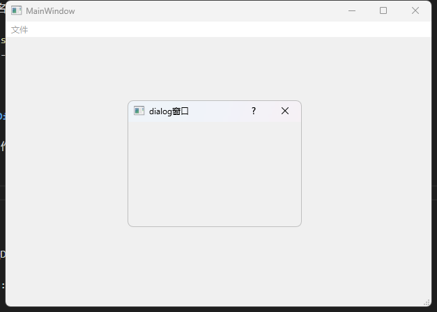
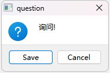
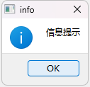
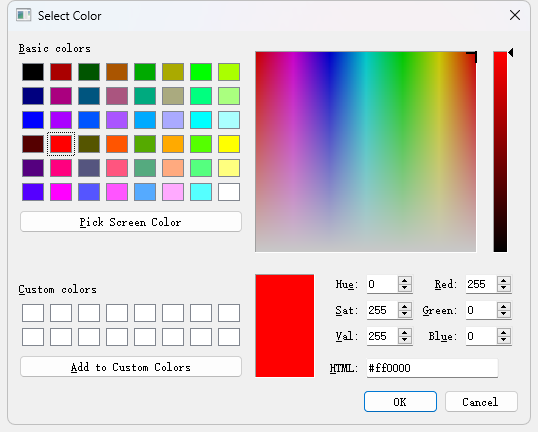
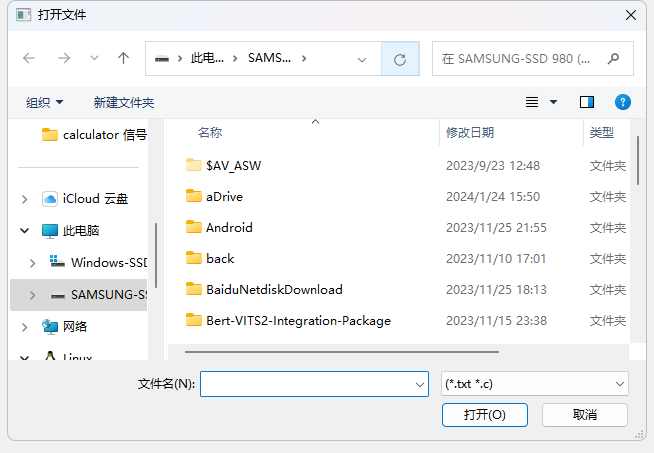
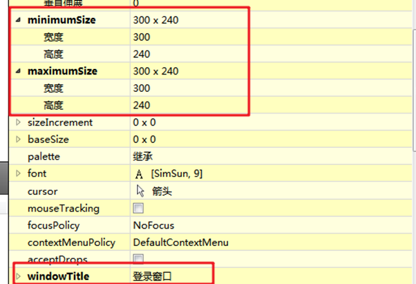
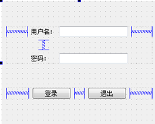

- [QT](#qt)
  - [快捷键](#快捷键)
  - [信号与槽](#信号与槽)
  - [主窗口（QMainWindows）](#主窗口qmainwindows)
    - [1.菜单栏（只能有一个）](#1菜单栏只能有一个)
    - [2.工具栏（可以有多个）](#2工具栏可以有多个)
    - [3.状态栏（只能有一个）](#3状态栏只能有一个)
    - [4.铆接部件 （浮动窗口，可以有多个）](#4铆接部件-浮动窗口可以有多个)
    - [5.核心部件（主窗口，只能有一个）](#5核心部件主窗口只能有一个)
    - [资源文件](#资源文件)
  - [对话框](#对话框)
    - [模态和非模态对话框 QDialog](#模态和非模态对话框-qdialog)
    - [消息对话框](#消息对话框)
    - [其他标准对话框](#其他标准对话框)
  - [布局管理](#布局管理)
  - [常用控件-按钮组](#常用控件-按钮组)


# QT
## 快捷键
```tex
    运行 CTRL + R  run
    编译 CTRL + B  build
    格式化  CTRL + i
    同名的.cpp .h切换 F4
    查看文档 F1
```

## 信号与槽
信号与槽优点，松散耦合

```cpp
QObject::connect(scrollBar, SIGNAL(valueChanged(int value)),
                   label, SLOT(setNum(int value)));
// 参数：
//     scrollBar：信号发送者   类实例地址
//     SIGNAL(valueChanged(int value))：发送的信号  函数指针地址
//     label：信号的接收者  类实例地址
//     SLOT(setNum(int value)): 槽函数 槽函数地址
```

**自定义信号与槽的实现**
1. 自定义信号

    自定义信号 写道signals下面
    1. 不需要返回值 void
    2. 只需要声明，不要实现
    3. 可以有参数，可以发生重载
    ```cpp
    signals:
        // 下课函数,定义了一个信号
        void hungry();
    ```
2. 自定义槽函数

    槽函数 写到public slots下，或者 public 或者全局函数 lambda
    1. 返回值 void
    2. 需要声明 需要实现
    3. 可以有参数 可以重载
    ```cpp
    // 声明一个槽函数
    public slots:
        void treat();

    // 定义槽函数
    void student::treat()
    {
        qDebug() << "请老师吃饭";
    }
    ```

3. 发送信号

    使用emit关键字
    ```cpp
    // 发送tea实例的hungry型号
    emit tea->hungry();
    ```

3. 使用connect函数联系起来
    ```cpp
    connect(tea, &teacher::hungry, stu, &stu::treat)
    ```
    

信号与槽发送重载时，使用connect连接时要使用函数指针做类型转化
```cpp
connect(tea, (void(teacher::*)(QString))&teacher::hungry, this->stu, (void(student::*)(QString))&student::treat);
```


信号与槽拓展
1. 信号连接信号 (信号的参数遵循4，5元组)
2. 多个信号连接一个槽函数
3. 一个信号连接多个槽函数
4. 信号和槽的参数类型必须一一对应
5. 信号的参数可以多余槽函数的参数，反之不行 
    1. 当信号与槽函数的参数数量相同时，它们参数类型要完全一致。
    2. 当信号的参数与槽函数的参数数量不同时，只能是信号的参数数量多于槽函数的参数数量，且前面相同数量的参数类型应一致，信号中多余的参数会被忽略。
6. 可以利用disconnect函数断开连接（connect如何传参，dosconnect就怎么传参）

QT4版本的信号槽写法
```cpp
// 优点：参数直观，写法简单
// 缺点：编译器不检测参数类型
connect(tea, SIGNAL(hungry(QString)), stu, SLOT(treat(QString)))
```


lambda表达式
```cpp
// 语法
[=](){/*函数体*/}
// 使用
connect(tea, SIGNAL(hungry(QString)), [=](){
    treat()
    });

```

## 主窗口（QMainWindows）

### 1.菜单栏（只能有一个）
1. QMenuBar * bar =  menuBar()  创建菜单栏
2. setMenuBar(bar) 设置窗口中
3. QMenu * fileMenu  =  bar->addMenu(“文件”); 添加菜单
4. QAction * newAtcion = fileMenu->addAction(“新建”); 添加菜单项

```cpp
   //1. 菜单栏 （只能有一个）
    QMenuBar *bar = menuBar();
    // 菜单栏设置到窗口中
    this->setMenuBar(bar);
    // 添加菜单
    QMenu* fileMenu = bar->addMenu("文件");
    // 添加菜单项
    QAction* newAction = fileMenu->addAction("新建");
    // 添加分割线
    fileMenu->addSeparator();
    QAction* openAction = fileMenu->addAction("打开");

    // 菜单项中有子菜单
    QMenu* subMenu = new QMenu;
    subMenu->addAction("子菜单1");
    subMenu->addAction("子菜单2");
    newAction->setMenu(subMenu);
```

### 2.工具栏（可以有多个）
1. QToolBar * toolbar = new QToolBar(this);
2. addToolBar( Qt::LeftToolBarArea , toolBar )
3. 设置后期停靠区域 setAllowedAreas
4. 设置浮动  setFloatable
5. 设置移动  setMovable
6. 添加菜单项  addAction
7. 添加分割线  addSeparator

```cpp
    //2. 工具栏  可以多个
    QToolBar* toolBar = new QToolBar(this);
    // 将工具栏设置到窗口中
    this->addToolBar(toolBar);
    // 添加toolbar选项
    toolBar->addAction("关闭");

    // 设置toolbar初始位置
    QToolBar* toolBar2 = new QToolBar(this);
    this->addToolBar(toolBar2);
    // 将工具栏设置到窗口中，设置工具栏到窗口左边
    this->addToolBar(Qt::LeftToolBarArea,toolBar2);

    // 设置只允许左右位置停靠
    toolBar->setAllowedAreas(Qt::TopToolBarArea | Qt::BottomToolBarArea);
    // 设置浮动
    toolBar->setFloatable(false);
    // 设置移动 (false 为工具栏窗口禁止拖动)
    toolBar2->setMovable(false);

    // 工具栏添加选项  分割线
    toolBar2->addAction("新建");
    toolBar2->addSeparator();
    toolBar2->addAction("关闭");
```

### 3.状态栏（只能有一个）
1. QStatusBar * sBar = statusBar();
2. setStatusBar(sBar);
3. 添加标签 显示到状态栏中

```cpp
    //3. 状态栏  只能有一个
    QStatusBar *sBar = new QStatusBar(this);
    // 设置状态栏
    this->setStatusBar(sBar);
    QLabel *label1 = new QLabel("左侧信息", this);
    sBar->addWidget(label1);

    QLabel *label2 = new QLabel("右侧信息", this);
    sBar->addPermanentWidget(label2);

    // 从最左边上插入
    QLabel *label3 = new QLabel("左侧信息2", this);
    sBar->insertWidget(0, label3);

    // 从最右边插入
    QLabel *label4 = new QLabel("右侧信息2", this);
    sBar->insertPermanentWidget(0, label4);
```
### 4.铆接部件 （浮动窗口，可以有多个）
1. QDockWidget * dock = new QDockWidget(“标题”,this);
2. addDockWidget(Qt::BottomDockWidgetArea,dock);
3. 设置停靠 setAllowedArea( )

```cpp
    // 铆接部件  浮动窗口  可以多个
    QDockWidget *dock =  new QDockWidget("浮动窗口", this);
    // 添加dock窗口
    addDockWidget(Qt::BottomDockWidgetArea, dock);
    // 设置只允许上下停靠
    dock->setAllowedAreas(Qt::TopDockWidgetArea | Qt::BottomDockWidgetArea);
//    dock->setFloating(true);
```
### 5.核心部件（主窗口，只能有一个）
1. QTextEdit  * edit = new QTextEdit(this);
2. setCentralWidget（edit）;

```cpp
    //5. 核心部件(主窗口)  只能有一个
    QTextEdit* edit = new QTextEdit(this);
    // 设置核心部件
    setCentralWidget(edit);
```

### 资源文件

- 导入资源文件
    1. 将资源文件放到目录下
    2. 添加资源文件
        1. 右键项目->添加新文件->Qt->Qt resource file
        2. 给资源文件起名 例如：res 生成res.qrc文件
    3. 编辑资源文件
        1. 添加前缀
        2. 添加文件
    4. 使用资源
        1. 语法 ":<前缀名><文件名>"
    ```cpp
        ui->actionnew->setIcon(QIcon(":/Image/Luffy.png"));
        ui->actiondakai->setIcon(QIcon(":/Image/OnePiece.png"));
    ```
## 对话框

### 模态和非模态对话框 QDialog
模态对话框
1. 不可以对其他窗口进行操作
2. QDialog(this)
3. dlg.reseize(w,h)
4. dlg.exec();

非模态对话框
1. 可以对其他窗口进行操作
2. QDialog *dlg = new QDialog(this);
3. dlg->resize(w, h)
4. dlg->setAttribute(Qt::WA_DeleteOnClose);
5. dlg>show()

```cpp
connect(ui->actionnew, &QAction::triggered,[=]{
        // 对话框的分类
        // 模态对话空  打开后，无法岁娶她窗口进行操作
        // 非模态对话框

        // 创建模态对话框
        QDialog dlg(this);
        dlg.exec();

        // 创建非模态对话框
        // QDialog dlg(this);
        // lamdba函数执行结束自动消失
        // dlg.show();
        // 使用堆区内存改进
        QDialog* dlg = new QDialog(this);
        // 设置属性  当关闭窗口时释放堆区对象
        dlg->setAttribute(Qt::WA_DeleteOnClose);
        dlg->show();
        qDebug() << "弹出对话框";
    });
```
### 消息对话框 

1. 错误提示 critical
2. 询问提示 question
3. 警告提示 warning
4. 消息提示 information
   
    
    
    
    


```cpp
    // 错误提示
    QMessageBox::critical(this, "critical", "错误!");
    // 信息提示
    QMessageBox::information(this, "info", "信息提示");

    // 询问提示  
    if(QMessageBox::Save == QMessageBox::question(this, "question", "询问!", QMessageBox::Save | QMessageBox::Cancel, QMessageBox::Save))
    {
        qDebug() <<  "选择了save按键";
    }else
    {
        qDebug() <<  "选择了cancel按键";
    }
    // 警告提示
    QMessageBox::warning(this, "warning", "警告");

    // 参数： 1.父窗口 2.标题 3.文本 4.按键类型  5.关联回车按键
```

### 其他标准对话框

1. 颜色对话框
   
    
    ```cpp
    // 颜射对话框  并获取用户获取的颜射
        QColor color = QColorDialog::getColor(QColor(255,0 , 0));
        qDebug() << color;
    ```
2. 字体对话框
   
    
    ```cpp
    // 字体对话框
        bool ok;
        QFont font = QFontDialog::getFont(&ok, QFont("宋体"));
        qDebug() << font;
    ```
3. 文件对话框

    
    ```cpp
    // 文件对话框
        QString fileName = QFileDialog::getOpenFileName(this, "打开文件", "D:/", "(*.txt *.c)");
        qDebug() << fileName;
    ```

## 布局管理

1. 利用widgets进行分组布局: 水平 垂直 栅格
2. 巧用弹簧进行设置






## 常用控件-按钮组
1. QPushButton 可以显示图标
    

2. QToolButton 工具按钮 默认优先显示图标
    

3. QRadioButton 单选按钮
    
    ```cpp
    // 单选按钮  设置默认选中
    ui->rBtn_man->setChecked(true);
    this->sex = true;
    // 监听 用户选中女选项
    connect(ui->rBtn_woman, &QRadioButton::clicked, [=](){
       qDebug() << "用户选择了女按钮";
       this->sex = false;
    });
    connect(ui->rBtn_man, &QRadioButton::clicked, [=](){
       qDebug() << "用户选择了男按钮";
       this->sex = true;
    });
    connect(ui->btn_commit, &QPushButton::clicked, [=](){
        qDebug() << "用户最终选择了 " << (this->sex == true ? "男" : "女");
    });
    ```

4. QCheckBox 复选按钮

    
    ```cpp
    // 监听复选按钮是否被选中
    ui->checkBox->setTristate(true); // 三中状态 未选中状态 半选中状态  state值分别为 0 1 2
    
    connect(ui->checkBox, &QCheckBox::stateChanged, [=](int state){
        qDebug() << state;
    });
    connect(ui->checkBox_2, &QCheckBox::stateChanged, [=](int state){
        qDebug() << state;
    });
    connect(ui->checkBox_3, &QCheckBox::stateChanged, [=](int state){
        qDebug() << state;
    });
    ```
    1. 半选状态属性设置
       
        
        ```cpp
        // 默认不开启半选状态
        ui->checkBox->setTristate(true); // 第三中状态 半选中状态  state值为1
        ```


