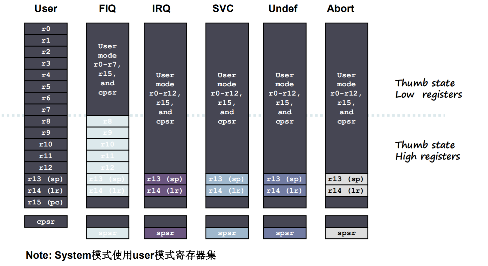
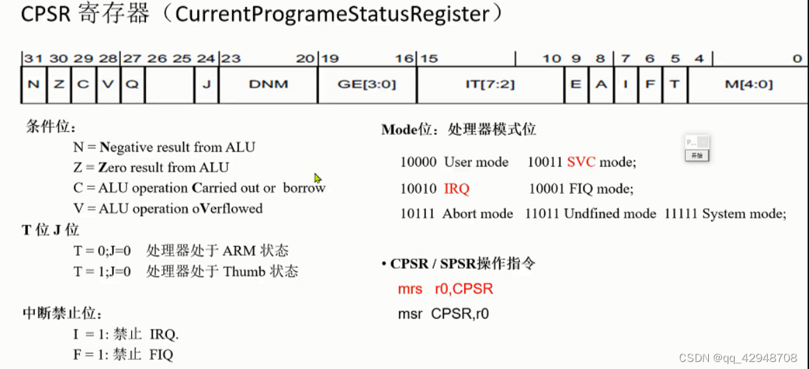

# ARM

## 概述

### 数据和指令集

- ARM 采用的是32位架构. 
- ARM 约定: 
    - Byte ： 8 bits 
    - Halfword ： 16 bits (2 byte) 
    - Word : 32 bits (4 byte) 
    - Doubleword 64-bits（8byte）（Cortex-A处理器） 
- 大部分ARM core 提供： 
    - ARM 指令集（32-bit） 
    - Thumb 指令集（16-bit ） 
        - Cortex-A处理器 
        - 16位和32位Thumb-2指令集 
        - 16位和32位ThumbEE指令集 
- Jazelle cores 支持 Java bytecode
  

Jazelle DBX（直接字节码执行）是一种扩展，允许某些ARM处理器在硬件中执行Java 字节码，作为现有 ARM 和Thumb模式之外的第三种执行状态。Jazelle 功能在 ARMv5TEJ 架构中指定，第一个采用 Jazelle 技术的处理器是ARM926EJ-S。Jazelle 由 CPU 名称后附加的“J”表示，但 v5 后的内核除外，为了实现架构一致性，需要使用 Jazelle（尽管只是简单的形式）。

### 处理器的工作模式

处理器的工作模式

ARM 有8个基本工作模式:
1. User: 非特权模式，大部分任务执行在这种模式
2. FIQ: 当一个高优先级（fast）中断产生时将会进入这种模式
3. IRQ: 当一个低优先级（normal）中断产生时将会进入这种模式
4. Supervisor: 当复位或软中断指令执行时将会进入这种模式
5. Abort: 当存取异常时将会进入这种模式
6. Undef: 当执行未定义指令时会进入这种模式
7. System: 使用和User模式相同寄存器集的特权模式
Cortex-A特有模式：
8. Monitor: 是为了安全而扩展出的用于执行安全监控代码的模式；也是一种特权

### 寄存器

ARM 寄存器
;

ARM 有37个32-Bits长的寄存器. 
- 1 个用作PC( program counter)
- 1个用作CPSR(current program status register)
- 5个用作SPSR(saved program status registers)
- 30 个通用寄存器

Cortex体系结构下有40个32-Bits长的寄存器
- Cortex-A多出3个寄存器，Monitor 模式 r13_mon , r14_mon,   spsr_mon

当前处理器的模式决定着哪组寄存器可操作. 任何模式都可以存取：
- 相应的 r0-r12子集
- 相应的 r13 (the stack pointer, sp) and r14 (the link register, lr)
- 相应的 r15 ( the program counter, pc)
- 相应的 CPSR(current program status register, cpsr)
特权模式 (除system模式) 还可以存取；
- 相应的 spsr （saved program status registe）


#### CPSR寄存器



常用的寄存器位有
- 28-31 条件码
- T位 J位用于控制arm的状态
  - T=0;J=0;处理器处于ARM状态  32位
  - T=1;J=0处理器处于Thumb状态 16位
  - T=1;J=1处理器处于ThumbEE状态 用于执行java字节码
- 低8位
  - 0-4位，arm处理器的特权级
  - 5位 T控制是否处于arm态
  - 6位7位分别控制是否禁止FRQ IRQ中断

#### 条件码

| 条件码 | 助记符后缀 | 标志                | 含义               |
| ------ | ---------- | ------------------- | ------------------ |
| 0000   | eq         | Z置位               | 相等               |
| 0001   | ne         | Z清零               | 不相等             |
| 0010   | cs         | C置位               | 无符号数大于或等于 |
| 0011   | cc         | C清零               | 无符号数小于       |
| 0100   | mi         | N置位               | 负数               |
| 0101   | pl         | N清零               | 正数或零           |
| 0110   | vs         | V置位               | 溢出               |
| 0111   | vc         | V清零               | 未溢出             |
| 1000   | hi         | C置位Z清零          | 无符号数大于       |
| 1001   | ls         | C清零Z置位          | 无符号数小于或等于 |
| 1010   | ge         | N等于V              | 带符号数大于或等于 |
| 1011   | lt         | N不等于V            | 带符号数小于       |
| 1100   | gt         | Z清零且（N等于V）   | 带符号数大于       |
| 1101   | le         | Z置位或（N不等于V） | 带符号数小于或等于 |
| 1110   | al         | 忽略                | 无条件执行         |


### 立即数

```tex
为了用有限的12位(4位-移位数 8位-数据)存放更多的数字
一个数字, 能通过一个 8位数 循环右移 偶数位 得到
0x123400 0000 0000 0001 0010 0011 0100 0000 0000 x
0x101 0000 0000 0000 0000 0000 0001 0000 0001 x 01 0000 0001 >> 0
0x10800 0000 0000 0000 0001 0000 1000 0000 0000 v 0100 0010 >> 22
0x102 0000 0000 0000 0000 0000 0001 0000 0010 x 1000 0001 >> 31
0xf000000f 0xff>>4 v
0x1000001 0000 0001 0000 0000 0000 0000 0000 0001 x 0001 v0000 0001 >> 8
0x10000001 0001 0000 0000 0000 0000 0000 0000 0001 v 0001 0001 >> 4
判断一个数是否是立即数:
先转换成二进制数据, 转换成32位
将数据看成一个环, 一次性去掉当中连续的偶数个0
```

### 常用指令

#### 数据传送 指令

mov 简单传送

mvn 取反传送

算数逻辑指令

add 加法指令

adc 加法指令，带进位

sub 减法指令

sbc 减法指令，带进位

rsb 反向减法指令，被减数与减数交换

rsc 反向减法指令，带进位

mul 乘法指令

and 按位与

orr 按位或

eor 按位异或

bic 按位清0

#### 比较指令

cmp 比较指令

cmn 负数比较指令

tst 位测试指令

teq 相等指令，只影响Z位

#### 存储器访问指令

ldr和str 单寄存器读写指令   ldrb(byte) ldrh(half world)  ldr(word)

ldm和stm 多寄存器读写指令（多用于栈）

swp 交换指令

#### 软中断

swi #number 调用相应中断号的中断

#### 伪指令

##### 数据定义指令


