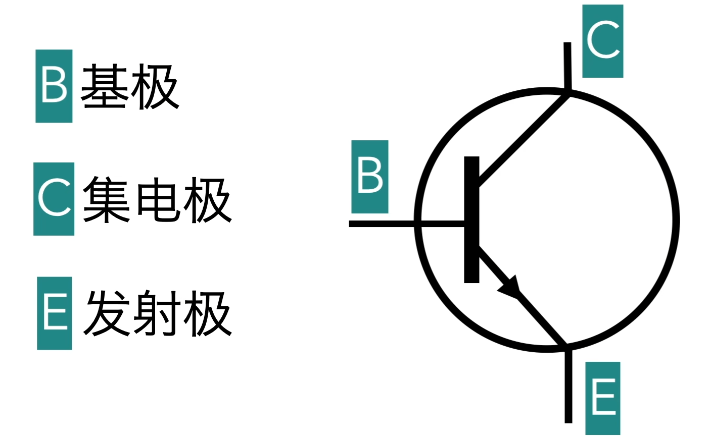

# 51单片机

## 51单片机简介

51单片机是一种8位单片机，由Intel公司于1980年代初开发，是当时世界上最小、最便宜的单片机。51单片机的内部结构和8086微处理器相似，但是51单片机的指令集比8086微处理器要简单得多，因此51单片机的学习门槛比较低，是入门单片机的好选择。

## 电子元器件

### 三极管

三极管是一种电子元器件，它由三个电极组成，分别是基极（Base）、集电极（Collector）和发射极（Emitter）。三极管的作用是控制电流的流动，它的工作原理是当电流从基极流向集电极时，三极管就会导通，电流就会从集电极流向发射极。三极管的电路图如下：

三极管分两种，有PNP三极管和NPN三极管

如何区分：观察三极管的箭头指向，箭头由P->N

## 组合逻辑器件

### 74hc138

### 74hc245

## I/O口

P1口是51单片机的8位I/O口，它的作用是用来连接外部的电路，例如LED灯、按键、数码管等。

### I/O口的使用

51单片机的I/O口有

I/O口的使用分为两种方式：

1. 直接操作I/O口

   例如：P1=0xAA;  //1010 1010 将P1口的0 2 4 6 位都置为低电平
   直接操作的进阶用法：
   使用位移运算符，例如：P1=0xAA<<1; 0101 0100 //将P1口的0 1 3 5 位都置为低电平

2. 通过位操作

   例如：P1.0=0; //将P1口的第0位置为低电平

   使用位操作的好处是可以单独控制I/O口的每一位，


```c
// 使1左移或0左移
// 使1左移
unsigned char i = 0x01;  // 0000 0001
while(1)
{
    P0 = i;
    i << 1;  // 0000 0001 -> 0000 0010 
    delay(100);
    if(i == 0x00)
        i = 0x01;

        
}

//使0左移
// 1
unsigned char i = 0x01;  // 0000 0001
while(1)
{
    P0 = ~i;   // P0 = 1111 1110
    i << 1;  // 0000 0001 -> 0000 0010    ~i = 1111 1101
    delay(100);
    if(i == 0x00)
        i = 0x01;  
}
    
// 2
unsigned char i = 0xFE;   //1111 1110
while(1)
{
    P0 = i;
    i << 1;   // 1111 1110 -> 1111 1100
    i | 0x01;   // 1111 1100 -> 1111 1101  或操作使补0位为1
    delay(100);
    if(i == 0xFF)
        i = 0xFE;
}


```
