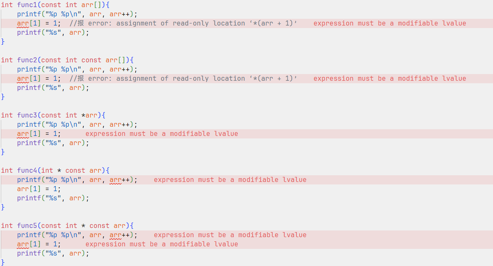

# C语言查缺补漏

## 基础

> 赋值运算符： 赋值运算符的返回值为赋值本身（从右至左运算）

```c
//example
int a = 100;
int x = a = 90;
//结果为 x = 90，其中x的值为a = 90,为这个运算符的返回值
//在系统编程中的案例
if((len = read(fd,buf,sizeof(buf))) != 0)
// 此时比较的是 0 与 len = read(fd,buf,sizeof(buf))这个赋值运算符的返回值
```

> 逗号表达式： 逗号表达式的值为最后一个表达式的值（从左至右运行）

```c
//example
void func()
{
    int a = 10;
    int b = 10, c, d, e;
    int r = (b++, c++, d + 3, e = b + c, ++a);
    printf("a=%d,b=%d,c=%d,d=%d,e=%d,r=%d\n",a,b,c,d,e,f,r);
}
// 其中r为最后一个表达式++a的值

void f3()
{
    int a = 10;
    int b = 20;
    int r = (a++, b++);
    printf("a=%d,b=%d,r=%d", a, b, r);
}
// 其中r的值为b，先赋值再执行++操作
```

> 移位运算符

右移 >>
(1) 无符号右移 补0
(2) 有符号右移 补符号位

左移 <<
均补0

```c
// example
char i = 127; // 0111 1111
char j = -1;  // 1111 1111
unsigned char k = 255; // 1111 1111

//左移 补0
i << 1;  // 0111 1111 -> 1111 1110
j << 1;  // 1111 1111 -> 1111 1110
k << 1;  // 1111 1111 -> 1111 1110

//右移  补符号位
i >> 1;  // 0111 1111 -> 0011 1111
j >> 1;  // 1111 1111 -> 1111 1111
k >> 1;  // 1111 1111 -> 0111 1111 
```

> register 和 auto

- register和auto都是只能声明局部变量，不能声明全局变量
- 局部变量存储在栈中
- 使用register定义的变量，没有内存地址，无法对其进行取地址操作
```c
// example
int i; // ==> auto int i;   使用auto时，可以省略auto
register int j; // register不能省略，使用该关键字的变量存储一般在寄存器
int *p = &j; //将会报错 error: address of register variable ‘j’ requested
```

> 多文件编译

extern关键字，.h文件, 与条件编译
[详细解析](https://www.runoob.com/w3cnote/extern-head-h-different.html)

函数的声明可以不用加extern

```c
// 全局变量的声明与定义
extern int a; // 声明一个全局变量 a
int a; // 定义一个全局变量 a
extern int a =0 ; // 定义一个全局变量 a 并给初值。
int a =0;    // 定义一个全局变量 a, 并给初值，
```

example
```c
// main.c
#include <stdio.h>
#include "func.h"
int main(int argc, char *argv[])
{ 
    func1();
    func2();
    printf("%d\n",a);
    return 0;
} 
```

```c
// func.c
#include <stdio.h>
#include "func.h"  // 被调用文件应该导入自己的头文件，以至于无视函数间的顺序

int a = 1;
void func1(){
    printf("this is func1\n");
}
void func2(){
    printf("this is func2\n");
}
```

```c
// func.h
#ifndef FUNC_H  // 条件编译命令在预处理时起作用
#define FUNC_H  

void func1();
void func2();
extern int a;

#endif
```

## 指针

> 指针变量的定义
```
基本指针变量
[存储类型] 数据类型 *变量名

数组指针arr
[存储类型] 数据类型 (*变量名)[数组步长]

存储指针的数组
[存储类型] 数据类型 *变量名[数组大小]

函数指针
``` 
> 指针和多维数组

```c
int arr[5][2];
```
`arr`是数组`arr[2]`的首地址，该数组有5个元素

`arr[0]`是数组`(arr[0])[2]`的首地址，该数组有2个元素

下面，从指针的角度进行分析:

因为`arr`是数组首元素的地址，所以`arr`的值和`&arr[0]`的值相同。 而`arr[0]`本身是一个内含两个整数的数组，所以`arr[0]`的值和它首元素 (一个整数)的地址(即`&arr[0][0]`的值)相同。简而言之，`arr[0]`是一个占用一个`int`大小**对象**的地址，而`arr`是一个占用两个`int`大小**对象**的地 址。由于这个整数和内含两个整数的数组都开始于同一个地址，所以`arr` 和`arr[0]`的值相同。

给指针或地址加1，其值会增加对应类型大小的数值。在这方面，`arr` 和`arr[0]`不同，因为`arr`指向的对象占用了两个`int`大小，而`arr[0]`指向的 对象只占用一个`int`大小。因此，`arr + 1`和`arr[0] + 1`的值不同。

解引用一个指针（在指针前用\*运算符）或在数组名后使用带下标的`[]`运算符，得到引用对象代表的值。

因为`arr[0]`是该数组首元素(`arr[0] [0]`)的地址，所以`*(arr[0])`表示储存在`arr[0][0]`上的值(即一个`int`类型 的值)。与此类似，`*arr`代表该数组首元素(`arr[0]`)的值，但是 `arr[0]`本身是一个int类型值的地址。该值的地址是`&arr[0][0]`，所以 `*arr`就是`&arr[0][0]`。

对两个表达式应用解引用运算符表明，`**arr`与 `*&arr[0][0]`等价，这相当于`arr[0][0]`，即一个int类型的值。简而言之， `arr`是地址的地址，必须解引用两次才能获得原始值。地址的地址或指针的指针是就是双重间接(double indirection)的例子。

因此`arr`的数据类型从指针的角度来看为`int **arr`,而`arr[0]`的数据类型从指针的角度来看为`int *arr`

```c
// 一维数组
int arr[5];
int *p;

//二维数组
int arr[5][4];         // arr[5] == &arr[5][0]  类型为 int *
int (*p)[4];

//三维数组
int arr[5][4][3];
int (*p)[4][3];


```


> const 修饰符

虽然`#define`指令可以创建类似功能的符号常量，但是const的用法更加灵活。除了基本数据类型之外，还可以创建`const数组`，`const指针`，`指向const的指针`

c标准规定：使用非`const`标识符修改`const`数据导致的结果是未定义的

判断`const`作用的关键在于看`const`相对于*运算符的位置

const数组
```c
[存储类型] const 数据类型 变量名[]
[存储类型] 数据类型 const 变量名[]
```

指向const的指针
```c
[存储类型] const 数据类型 * 变量名  //效果和const数组类似
[存储类型] 数据类型 const * 变量名
```

const指针
```c
[存储类型]  数据类型 * const 变量名  
```

两个const的指针
```c
[存储类型] const 数据类型 * const 变量名
[存储类型] 数据类型 const *  const 变量名
```


> 对形式参数使用const，以保证传入函数的数据不被修改

```c
int func1(const int arr[]){
    printf("%p %p\n", arr, arr++);
    arr[1] = 1;  //报 error: assignment of read-only location ‘*(arr + 1)’
    printf("%s", arr);
}
//  在这种情况下，arr为指向const的指针，指针的值可变，指针指向的值不可变

int func2(const int const arr[]){
    printf("%p %p\n", arr, arr++);
    arr[1] = 1;  //报 error: assignment of read-only location ‘*(arr + 1)’
    printf("%s", arr);
}
//  在该定义中，效果同上，指针的值可变，指针指向的值不可变  arr[] => *(arr)

int func3(const int *arr){
    printf("%p %p\n", arr, arr++);
    arr[1] = 1;  
    printf("%s", arr);
}
//  在该定义中，效果同上，指针的值可变，指针指向的值不可变

int func4(int * const arr){
    printf("%p %p\n", arr, arr++);
    arr[1] = 1;  
    printf("%s", arr);
}
//  在该定义中，形参声明为常量指针，指针的值不可变，指针指向的值可变

int func5(const int * const arr){
    printf("%p %p\n", arr, arr++);
    arr[1] = 1;  
    printf("%s", arr);
}
//  在该定义中，形参声明为常量指针，且指向的值也是常量，指针的值，指针指向的值均不可变
```

结果如下




## 存储类别，链接和内存管理

### 存储类别

> 链接

c变量有三种属性的链接：
- 外部链接
- 内部链接
- 无链接

> 块作用域的静态变量

> 外部链接的静态变量

> 内部链接的静态变量


