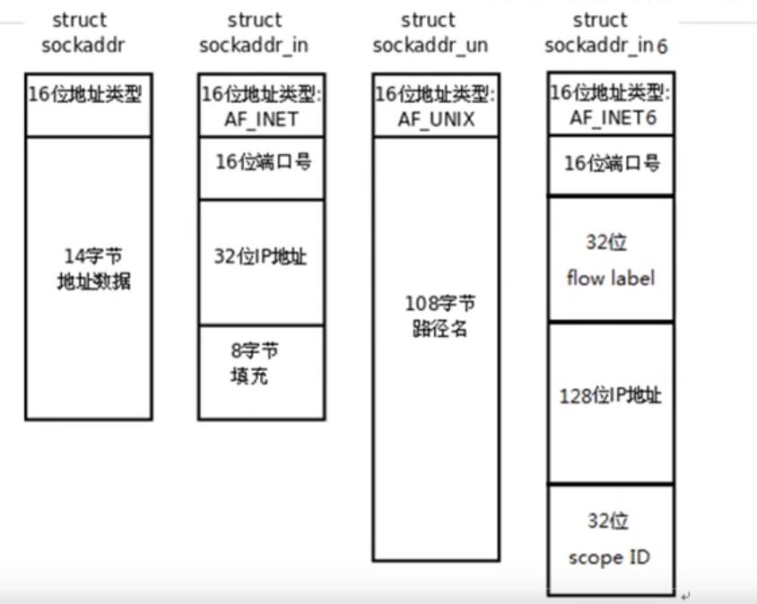
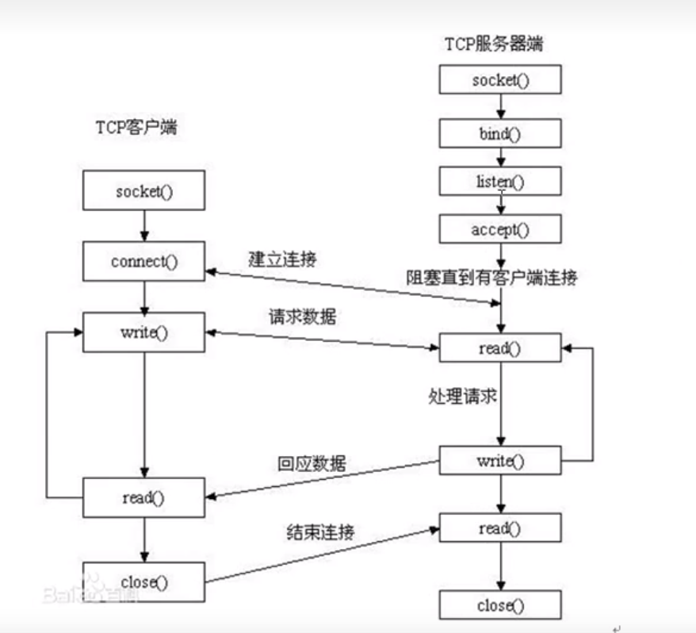
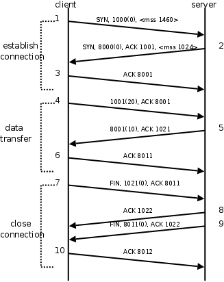
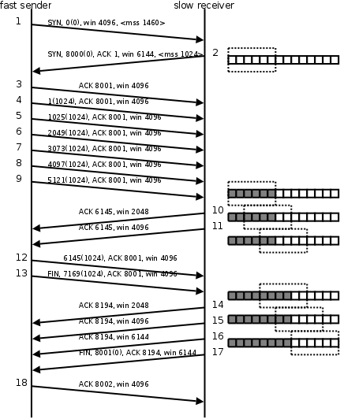
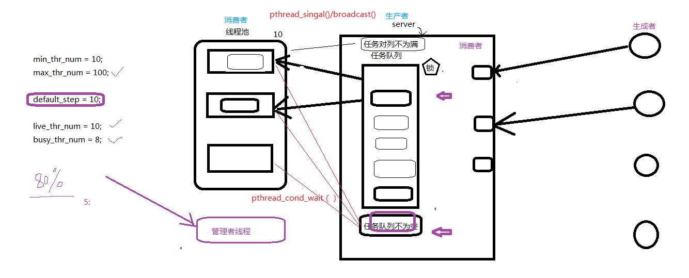

[toc]

## linux网络基础

### 七层模型与四层模型及代表协议

#### OSI七层模型

| OSI参考模型 |      |     TCP/IP模型     |
| :---------: | :--: | :----------------: |
|   应用层    |  ⌉   |                    |
|   表示层    | ---> |       应用层       |
|   会话层    |  ⌋   |                    |
|   传输层    |      |       传输层       |
|   网络层    |      |       网络层       |
| 数据链路层  | ---> | 网络接口层(链路层) |
|   物理层    |  ⌋   |                    |

#### TCP/IP协议代表协议

应用层: http,ftp,nfs,ssh,telnet...
传输层: TCP UDP
网络层: IP ICMP IGMP
链路层: 以太网帧协议, arp协议

#### 网络传输流程

数据没有封装之前，是不能在网络中传递。
**数据**--封装-->**应用层**--封装-->**传输层**--封装-->**网络层**--封装-->**链路层**

#### 以太网帧协议

ARP协议:根据Ip地址获取mac地址。
以太网帧协议:根据mac地址，完成数据包传输。

#### IP协议

版本:IPv4、IPv6 -- 4位
TTL: time to live 。设置数据包在路由节点中的跳转上限。每经过一个路由节点，该值-1，减为o的路由，有义务将该数据包丢弃
源IP:32位。--- 4字节   192.168.1.108---点分十进制IP地址(string) ---二进制
目的IP:32位。--- 4字节

IP地址:可以在网络环境中，唯一标识一台主机。
端口号:可以网络的一台主机上，唯一标识一个进程。
IP地址+端口号:可以在网络环境中，唯一标识一个进程。

## Socket编程

套接字概念
一个文件描述符指向一个套接字（该套接字内部由内核借助两个缓冲区实现）
在通信过程中，套接字一定使成对出现的

### 网络字节序

我们已经知道，内存中的多字节数据相对于内存地址有大端和小端之分，磁盘文件中的多字节数据相对于文件中的偏移地址也有大端小端之分。网络数据流同样有大端小端之分，那么如何定义网络数据流的地址呢﹖发送主机通常将发送缓冲区中的数据按内存地址从低到高的顺序发出，接收主机把从网络上接到的字节依次保存在接收缓冲区中，也是按内存地址从低到高的顺序保存，因此，网络数据流的地址应这样规定:先发出的数据是低地址，后发出的数据是高地址。
TCP/IP 协议规定，网络数据流应采用大端字节序，即低地址高字节。例如上一节的UDP段格式，地址0-1是16位的源端口号，如果这个端口号是1000
(Ox3e8)，则地址o是Ox03，地址1是Oxe8，也就是先发Ox03，再发 Oxe8，这16位在发送主机的缓冲区中也应该是低地址存Ox03，高地址存Oxe8。但
是，如果发送主机是小端字节序的，这16位被解释成Oxe803，而不是1000。因此，发送主机把1000填到发送缓冲区之前需要做字节序的转换。同样地，
接收主机如果是小端字节序的，接到16 位的源端口号也要做字节序的转换。如果主机是大端字节序的发送和接收都不需要做转换。同理，32位的P地址也
要考虑网络字节序和主机字节序的问题。

```c
//ip地址网络字节序和主机字节序的转换
#include<arpa/inet.h>
uint32_t htonl(uint32_t hostlong);  //host to net   针对于IP地址
uint16_t htons(uint16_t hostshort); //host to net   针对于port
uint32_t ntohl(uint32_t netlong); //net to host   针对于IP
uint16_t ntohs(uint16_t netshort);  //net to host  针对于PORT
```

### ip地址转换函数

```c
//点分十进制转网络字节序  // 支持ipv4 和 ipv6
#include <arpa/inet.h>
int inet_pton(int af, const char *src, void *dst);
// 参数： 
//   af：AF_INET AF_INET6  选择转换格式
//   src：传入参数 ip地址 点分十进制字符串
//   dst：传出参数 转换后的网络字节序
// 返回值：
//   成功：1
//   异常：0  src指向的不使一个有效的IP地址
//   失败：-1 errno

const char *inet_ntop(int af, const void *src, char *dst, socklen_t size);
// 参数：
//   af：AF_INET AF_INET6  选择转换格式
//   src：网络字节序的ip地址
//   dst：转换后的本地字节序
//   size：传出参数的大小

// 返回值：
//   成功：电视台
//   失败：NULL 
```

### sockaddr数据结构

sockaddr地址结构


```c
struct sockaddr_in {
  sa_family_t    sin_family; /*address family: AF_INET*/
  in_port_t      sin_port;   /*port in network byte order*/
  struct in_addr sin_addr;   /*internet address*/
};

/* Internet address. */
struct in_addr {
  uint32_t       s_addr;     /* address in network byte order */
};

// 赋值
sockaddr_in addr;
addr.sin_family = AF_INET / AF_INET6;
addr.sin_port = htons(9527);

int dst;
inet_pton(AF_INET, "192.168.6.1", (void*)&dst);
addr.sinaddr.s_addr = dst;

addr.sinaddr.s_addr = inet_addr("192.168.6.1");

addr.sin_addr.s_addr = htonl(INADDR_ANY);    //取出系统中有效的任意IP地址

//传参
bind(fd, (struct sockaddr*)&addr, size);


```

### socket模型创建流程



| 客户端                   | 服务端                         |
| ------------------------ | ------------------------------ |
| socket()                 | socket()                       |
| connect() //建立连接 绑定ip和端口     | bind(); //绑定IP port          |
| write()                  | listen()  //设置监听上限       |
| read()                   | accept()  //阻塞监听客户端链接 |
| close()                  | read()                         |
|                          | write()                        |
|                          | read()                         |
|                          | close()                        |
|                          |                                |

#### 函数介绍

```c
#include <sys/socket.h>
int socket(int domain, int type, int protocol);  // 创建套接字
// 参数：
//   domain  指定ip地址协议  AF_INET、AF_INET6、AF_UNIX
//   type   指定数据传输协议  SOCK_STREAM（TCP）   SOCK_DGRAM（UDP）
//   protocol   一般传0
// 返回值：
//   成功：新套接字对应的文件描述符
//   失败：-1 errno

int bind(int sockfd, const struct sockaddr *addr, socklen_t addrlen); // 给socket绑定一个地址结构（ip port）
参数：
  socketfd 套接字的文件描述符
  addr 传入参数 地址结构
  addrlen 地址结构大小 sizeof()

返回值：
  成功 0
  失败 -1 errno 

int listen(int sockfd, int backlog);  // 设置同时与服务器建立链接的上限数
// 参数：
//   sockfd socket文件描述符
//   backlog 上限值 最大128
// 返回值：
//   成功 0
//   失败 -1 errno

int accept(int sockfd, struct sockaddr *addr, socklen_t *addrlen);  // 阻塞等待客户端建立连接 成功返回一个与客户端成功连接的socket文件描述符
// 参数：
//   socket 用于监听的socket文件描述符
//   addr  传出参数 客户端的地址结构（ip+port）
//   addrlen  传入传出参数 传入addr大小 传出客户端addr的实际大小  sizeof 

// 返回值：
//   成功 进行通信的文件描述符
//   失败 -1 errno


int connect(int sockfd, const struct sockaddr *addr,socklen_t addrlen);  //连接服务端
参数：
  socket :socket函数返回值
  addr： 服务器的地址结构
  addrlen: 服务器地址结构大小
返回值：


```

#### tcp客户端

```c
int main(int argc,char *argv[])
{
  int ret;
  int cli_fd;
  struct sockaddr_in ser_addr;

  cli_fd = socket(AF_INET, SOCK_STREAM, 0);
  ser_addr.sin_family = AF_INET;
  ser_addr.sin_port = htons(12500);
  ser_addr.sin_addr.s_addr = inet_addr("127.0.0.1");
  ret = connect(cli_fd, (struct sockaddr*)&ser_addr, sizeof(ser_addr));
  while(1){
    char buf[1024];
    scanf("%s", buf);
    write(cli_fd, buf, sizeof(buf));
  }
  close(cli_fd);
  return 0;
}
```

#### tcp服务端

```c

int main(int argc,char *argv[])
{
  int ret;
  char buf[1024];
  int lfd,ser_fd;
  struct sockaddr_in ser_addr, c_addr;

  lfd = socket(AF_INET, SOCK_STREAM, 0);

  ser_addr.sin_family = AF_INET;
  ser_addr.sin_port = htons(12500);
  ser_addr.sin_addr.s_addr = inet_addr("127.0.0.1");
  ret = bind(lfd, (struct sockaddr*)&ser_addr, sizeof(ser_addr));
  if(ret == -1){
    sys_err("bind err");
  }

  ret = listen(lfd, 255); 

  socklen_t cli_addr_len = sizeof(c_addr);
  ser_fd = accept(lfd, (struct sockaddr*)&c_addr, &cli_addr_len);

  printf("client connect success: ip = %s port = %d\n",inet_ntoa(c_addr.sin_addr), ntohs(c_addr.sin_port));

  while(1){
    
    ret = read(ser_fd, buf, sizeof(buf));
    buf[ret] = '\0';   // 使字符串末位赋0 防止乱码
    if(ret == 0){
      break;
    }
    printf("from clint: %s\n", buf);  //使用换行符，使服务端能刷新缓冲区
  }
  close(lfd);
  close(ser_fd);
  return 0;
}
```

### TCP协议

#### TCP通信时序



在这个例子中，首先客户端主动发起连接、发送请求，然后服务器端响应请求，然后客户端主动关闭连接。两条竖线表示通讯的两端，从上到下表示时间的
先后顺序，注意，数据从一端传到网络的另一端也需要时间，所以图中的箭头都是斜的。双方发送的段按时间顺序编号为1-10，各段中的主要信息在箭头
上标出，例如段2的箭头上标着SYN, 8000(0), ACK1001, ，表示该段中的SYN位置1，32位序号是8000，该段不携带有效载荷（数据字节数为0），
ACK位置1，32位确认序号是1001，带有一个mss（Maximum Segment Size，最大报文长度）选项值为1024。

##### 三次握手

1. 客户端向主动服务端发送请求。SYN标志位为1，并附带当前包号（1000（0）），以及一个mss（Maximum Segment Size，最大报文长度）
2. 服务端收到客户端请求，同时对客服端发送连接请求，SYN标志位为1，并附带当前包号（8000（0）），以及缓冲区大小，并且做出应答，ACK标志位为1 附带接收后的对方的包号
3. 客户端应答服务端请求，发送ACK 附带接收到的包号

##### 数据传输

1. 客户端发出段4，包含从序号1001开始的20个字节数据。
2. 服务器发出段5，确认序号为1021，对序号为1001-1020的数据表示确认收到，同时请求发送序号1021开始的数据，服务器在应答的同时也向客户端发送从序号8001开始的10个字节数据，这称为piggyback。
3. 客户端发出段6，对服务器发来的序号为8001-8010的数据表示确认收到，请求发送序号8011开始的数据。

在数据传输过程中，ACK和确认序号是非常重要的，应用程序交给TCP协议发送的数据会暂存在TCP层的发送缓冲区中，发出数据包给对方之后，只有收到对方应答的
ACK段才知道该数据包确实发到了对方，可以从发送缓冲区中释放掉了，如果因为网络故障丢失了数据包或者丢失了对方发回的ACK段，经过等待超时后TCP协议自动
将发送缓冲区中的数据包重发

##### 四次挥手

由于TCP连接是全双工的，因此每个方向都必须单独进行关闭。这原则是当一方完成它的数据发送任务后就能发送一个FIN来终止这个方向的连接。收到一个 FIN只
意味着这一方向上没有数据流动，一个TCP连接在收到一个FIN后仍能发送数据。首先进行关闭的一方将执行主动关闭，而另一方执行被动关闭。

1. 客户端发出段7， 包含FIN标志位为1的数据报，请求断开连接
2. 服务端回应发出段8， 包号ACK标志位为1的数据报，应答客户端的关闭连接请求
3. 服务端再向客户端发出段7， 包含FIN标志位为1的数据包，请求断开连接
4. 客户端发出段10，包号ACK标志位为1的数据报，应答服务器的关闭连接请求

建立连接的过程是三方握手，而关闭连接通常需要4个段，服务器的应答和关闭连接请求通常不合并在一个段中，因为有连接半关闭的情况，这种情况下客户端关闭
连接之后就不能再发送数据给服务器了，但是服务器还可以发送数据给客户端，直到服务器也关闭连接为止。

#### 滑动窗口(TCP流量控制)

介绍UDP时我们描述了这样的问题：如果发送端发送的速度较快，接收端接收到数据后处理的速度较慢，而接收缓冲区的大小是固定的，就会丢失数据。TCP协议通
过“滑动窗口（Sliding Window）”机制解决这一问题。看下图的通讯过程：



1. 发送端发起连接，声明最大段尺寸是1460，初始序号是0，窗口大小是4K，表示“我的接收缓冲区还有4K字节空闲，你发的数据不要超过4K”。接收端应答连接请求，声明最大段尺寸是1024，初始序号是8000，窗口大小是6K。发送端应答，三方握手结束。
2. 发送端发出段4-9，每个段带1K的数据，发送端根据窗口大小知道接收端的缓冲区满了，因此停止发送数据。
3. 接收端的应用程序提走2K数据，接收缓冲区又有了2K空闲，接收端发出段10，在应答已收到6K数据的同时声明窗口大小为2K。
4. 接收端的应用程序又提走2K数据，接收缓冲区有4K空闲，接收端发出段11，重新声明窗口大小为4K。
5. 发送端发出段12-13，每个段带2K数据，段13同时还包含FIN位。
6. 接收端应答接收到的2K数据（6145-8192），再加上FIN位占一个序号8193，因此应答序号是8194，连接处于半关闭状态，接收端同时声明窗口大小为2K。
7. 接收端的应用程序提走2K数据，接收端重新声明窗口大小为4K。
8. 接收端的应用程序提走剩下的2K数据，接收缓冲区全空，接收端重新声明窗口大小为6K。
9. 接收端的应用程序在提走全部数据后，决定关闭连接，发出段17包含FIN位，发送端应答，连接完全关闭。

上图在接收端用小方块表示1K数据，实心的小方块表示已接收到的数据，虚线框表示接收缓冲区，因此套在虚线框中的空心小方块表示窗口大小，从图中可以看出，随着应用程序提走数据，虚线框是向右滑动的，因此称为滑动窗口。
从这个例子还可以看出，发送端是一K一K地发送数据，而接收端的应用程序可以两K两K地提走数据，当然也有可能一次提走3K或6K数据，或者一次只提走几个字节的数据。也就是说，应用程序所看到的数据是一个整体，或说是一个流（stream），在底层通讯中这些数据可能被拆成很多数据包来发送，但是一个数据包有多少字节对应用程序是不可见的，因此TCP协议是面向流的协议。而UDP是面向消息的协议，每个UDP段都是一条消息，应用程序必须以消息为单位提取数据，不能一次提取任意字节的数据，这一点和TCP是很不同的。

#### TCP状态转换

#### 半关闭

#### 2MSL

#### TCP异常断开

##### 端口复用

在server的TCP连接没有完全断开之前不允许重新监听是不合理的。因为，TCP连接没有完全断开指的是connfd（127.0.0.1:6666）没有
完全断开，而我们重新监听的是lis-tenfd（0.0.0.0:6666），虽然是占用同一个端口，但IP地址不同，connfd对应的是与某个客户端通
讯的一个具体的IP地址，而listenfd对应的是wildcard address。解决这个问题的方法是使用setsockopt()设置socket描述符的选项
SO_REUSEADDR为1，表示允许创建端口号相同但IP地址不同的多个socket描述符。
在server代码的socket()和bind()调用之间插入如下代码：

```c
int opt = 1;
setsockopt(listenfd, SOL_SOCKET, SO_REUSEADDR, &opt, sizeof(opt));
```

### 高并发服务器

#### 多进程并发服务器

使用多进程并发服务器时要考虑以下几点：

1. 父进程最大文件描述个数(父进程中需要close关闭accept返回的新文件描述符)
2. 系统内创建进程个数(与内存大小相关)
3. 进程创建过多是否降低整体服务性能(进程调度)

```c
void _waitpid(int sig){
  int ret;
  while((ret = wait(NULL)) != -1){
    
    printf("---catch child pid = %d\n",ret);
  }
  
}

int main(int argc,char *argv[])
{
  int ret, pid;
  char buf[1024];
  int lfd, cfd;
  signal(SIGCHLD, _waitpid);   //使用信号捕捉，及时处理僵尸进程
  lfd = socket(AF_INET, SOCK_STREAM, 0);

  struct sockaddr_in ser_addr;
  ser_addr.sin_family = AF_INET;
  ser_addr.sin_port = htons(12500);
  ser_addr.sin_addr.s_addr = inet_addr("127.0.0.1"); 
  
  ret = bind(lfd, (struct sockaddr*)&ser_addr, sizeof(ser_addr));

  ret = listen(lfd, 255);

  struct sockaddr_in c_addr;
  socklen_t c_addr_len = sizeof(c_addr);
  while (1)
  {
    cfd = accept(lfd, (struct sockaddr*)&c_addr, &c_addr_len);
    printf("client connect success: ip = %s port = %d\n",inet_ntoa(c_addr.sin_addr), ntohs(c_addr.sin_port));
    pid = fork();
    if(pid == 0){   //子进程
      close(lfd);   //fock后立即退出循环，防止后续逻辑混乱
      break;
    }else if (pid > 0)   //父进程
    {
      close(cfd);
      continue;
      
    }else{   //fork err
      sys_err("fork err");
    }
    
  }
  if(pid == 0){
     while(1){
        ret = read(cfd, buf, sizeof(buf));
        buf[ret] = '\0';
        if(ret == 0){
          break;
        }
        printf("from clint: %s", buf);
      }
      close(cfd);
  }
  
  return 0;
}
```

#### 多线程并行服务器

在使用线程模型开发服务器时需考虑以下问题：

1. 调整进程内最大文件描述符上限
2. 线程如有共享数据，考虑线程同步
3. 服务于客户端线程退出时，退出处理。（退出值，分离态）
4. 系统负载，随着链接客户端增加，导致其它线程不能及时得到CPU

```c
void* func(void* cfd){
  int ret;
  char buf[1024];
  
  while(1){
    memset(buf, '\0', sizeof(buf));
    ret = read((int)(intptr_t)cfd, buf, sizeof(buf));
    if(ret == 0){
      break;
    }
    buf[ret] = '\0';
    printf("from client: %s\n",buf);
  }


}

int main(int argc,char *argv[])
{
  int ret;
  int lfd, cfd;
  pthread_t tid;
  lfd = socket(AF_INET, SOCK_STREAM, 0);

  struct sockaddr_in ser_addr;
  ser_addr.sin_family = AF_INET;
  ser_addr.sin_port = htons(12500);
  ser_addr.sin_addr.s_addr = inet_addr("127.0.0.1");

  ret = bind(lfd, (struct sockaddr*)&ser_addr, sizeof(ser_addr));

  ret = listen(lfd, 255);

  struct sockaddr_in cli_addr;
  socklen_t cli_addr_len = sizeof(cli_addr);
  while(1){
    cfd = accept(lfd, (struct sockaddr*)&cli_addr, &cli_addr_len);
    printf("client connect success,ip= %s, port= %d\n", inet_ntoa(cli_addr.sin_addr), ntohs(cli_addr.sin_port));

    ret = pthread_create(&tid, NULL, func, (void*)(intptr_t)cfd);

    pthread_detach(tid);   //设置线程分离

  }
  return 0;
}
```

#### 多路IO转接服务器

路IO转接服务器也叫做多任务IO服务器。该类服务器实现的主旨思想是，不再由应用程序自己监视客户端连接，取而代之由内核替应用程序监视文件。

##### sleect

解决1024以下客户端时使用select是很合适的，但如果链接客户端过多，select采用的是轮询模型，会大大降低服务器响应效率，不应在select上投入更多精力
优缺点：
缺点： 监听上限受文件描述符限制，最大1024
      检测满足条件的fd，自己添加业务路基提高骁，提高了编码难度
优点： 跨平台，

```c
#include <sys/select.h>
int select(int nfds, fd_set *readfds, fd_set *writefds, fd_set *exceptfds, struct timeval *timeout);
// 参数：
//   nfds 监控的文件描述符集里最大文件描述符加1，因为此参数会告诉内核检测前多少个文件描述符的状态
//   readfds  监控有读数据到达文件描述符集合，传入传出参数   fd_set均为位图 
//   writefds  监控写数据到达文件描述符集合，传入传出参数
//   exceptfds  监控异常发生达文件描述符集合,如带外数据到达异常，传入传出参数
//   timeout  定时阻塞监控时间，3种情况
//             1. NULL，永远等下去  阻塞监听 
//             2. >0设置timeval，等待固定时间
//             3. 设置timeval里时间均为0，检查描述符后立即返回，轮询
// 返回值：
//   >0 所有监听集合中，满足所有事件的总数
//   0  没有满足条件的文件描述符
//   -1 err

void FD_CLR(int fd, fd_set *set);   //把文件描述符集合里fd清0
int FD_ISSET(int fd, fd_set *set);   //测试文件描述符集合里fd是否置1   为1返回1 为0返回0
void FD_SET(int fd, fd_set *set);   //把文件描述符集合里fd位置1
void FD_ZERO(fd_set *set);    //把文件描述符集合里所有位清0


```

代码实现

```c
int main(int argc,char *argv[])
{
 int lfd, cfd;
 int ret, maxfd, nread;
  char buf[1024];

  lfd = socket(AF_INET, SOCK_STREAM, 0);

  int opt = 1;
  ret = setsockopt(lfd, SOL_SOCKET, SO_REUSEADDR, &opt, sizeof(opt));
  struct sockaddr_in ser_addr;
  ser_addr.sin_family = AF_INET;
  ser_addr.sin_port = htons(12500);
  ser_addr.sin_addr.s_addr = htonl(INADDR_ANY);
  ret = bind(lfd, (struct sockaddr*)&ser_addr, sizeof(ser_addr)); 

  ret = listen(lfd, 255);

  fd_set r_set, all_set;   /* rset 读事件文件描述符集合  allset用来暂存*/
  maxfd = lfd;
  FD_ZERO(&all_set);
  FD_SET(lfd, &all_set);   /*添加lfd到监听集合*/
  
  while(1){
    r_set = all_set;

    nread = select(maxfd + 1, &r_set, NULL, NULL, NULL); 
      
    if(FD_ISSET(lfd, &r_set)){    //判断listen套接字是否满足监听条件
      struct sockaddr_in client_fd;
      socklen_t client_fd_len = sizeof(client_fd);
      cfd = accept(lfd, (struct sockaddr*)&client_fd, &client_fd_len);
   
      printf("client connect success: ip = %s, port = %d\n", inet_ntoa(client_fd.sin_addr), ntohs(client_fd.sin_port));
      FD_SET(cfd, &all_set);
      if(cfd > maxfd){
        // printf("cfd > maxfd---\n");
        maxfd = cfd;   //将产生的fd添加到监听集合中，监听数据的读事件
      }
      if(--nread == 0){      //只有lfd有新事件，后续读套接字不执行
      printf("1\n");
        continue;          
      }
    }

    for(int i = lfd + 1; i <= maxfd; i++){
      printf("%d\n",i);
      if(FD_ISSET(i, &r_set)){

        ret = read(i, buf, sizeof(buf));
        if(ret == -1){
          sys_err("read err");
        }
        if(ret == 0){
          FD_CLR(i, &all_set);
          close(i);
        }
        if(ret > 0){
          buf[ret] = '\0';
          printf("%s\n", buf);
        }
        
      }
    }
    
  }

  return 0;
}
```

使用client数组对fd遍历进行优化

```c
int main(int argc,char *argv[])
{
 int lfd, connfd, clientfd[FD_SETSIZE];    //自定义数组client，防止遍历1024个文件描述符
 int ret, maxfd, nread, maxi, i;
  char buf[BUFSIZ], str[INET_ADDRSTRLEN];

  lfd = socket(AF_INET, SOCK_STREAM, 0);

  int opt = 1;
  ret = setsockopt(lfd, SOL_SOCKET, SO_REUSEADDR, &opt, sizeof(opt));
  struct sockaddr_in ser_addr;
  ser_addr.sin_family = AF_INET;
  ser_addr.sin_port = htons(12500);
  ser_addr.sin_addr.s_addr = htonl(INADDR_ANY);
  ret = bind(lfd, (struct sockaddr*)&ser_addr, sizeof(ser_addr)); 

  ret = listen(lfd, 255);
  maxi = -1;
  for(int i = 0; i < FD_SETSIZE; i++){
    clientfd[i] = -1;
  }

  fd_set r_set, all_set;   /* rset 读事件文件描述符集合  allset用来暂存*/
  maxfd = lfd;
  FD_ZERO(&all_set);
  FD_SET(lfd, &all_set);   /*添加lfd到监听集合*/
  
  while(1){
    r_set = all_set;

    // printf("before select\n");
    // for(int i = lfd + 1; i <= maxfd; i++){
    //   printf("%d -> %d\n",i, FD_ISSET(i, &r_set));
    // }

    nread = select(maxfd + 1, &r_set, NULL, NULL, NULL);
    // printf("after select\n");
    if(nread < 0){    //判断select监听是否出错
        sys_err("select err");
      } 
    
      
    if(FD_ISSET(lfd, &r_set)){    //判断listen套接字满足监听条件，就建立新的连接
      struct sockaddr_in client_addr;
      socklen_t client_addr_len = sizeof(client_addr);
      connfd = accept(lfd, (struct sockaddr*)&client_addr, &client_addr_len);
      if(connfd == -1){ 
        sys_err("accept err");
      }
      printf("client connect success: ip = %s, port = %d\n", inet_ntoa(client_addr.sin_addr), ntohs(client_addr.sin_port));
      FD_SET(connfd, &all_set);
      
      for(i = 0; i < FD_SETSIZE; i++){  // 添加客户端数组
        if(clientfd[i] == -1){
          clientfd[i] = connfd;
          break;
        }
      }
      if(i > maxi){   
        maxi = i;
      }

  
      if(connfd > maxfd){
        // printf("clientfd > maxfd---\n");
        maxfd = connfd;   //将产生的fd添加到监听集合中，监听数据的读事件
      }
      if(--nread == 0){      //只有lfd有新事件，后续读套接字不执行
      // printf("1\n");
        continue;          
      }
    }

    for(int i = 0; i <= maxi; i++){
      // printf("%d\n",i);
      if(FD_ISSET(clientfd[i], &r_set)){

        ret = read(clientfd[i], buf, sizeof(buf));
        if(ret == -1){
          sys_err("read err");
        }
        if(ret == 0){
          FD_CLR(clientfd[i], &all_set);
          close(clientfd[i]);
        }
        if(ret > 0){
          buf[ret] = '\0';
          printf("%s\n", buf);
        }
        
      }
    }
    
  }

  return 0;
}
```

##### poll

```c
#include <poll.h>
int poll(struct pollfd *fds, nfds_t nfds, int timeout);
// 参数：
//   fds    监听文件描述符的数组
//   nfds   监控数组中有多少文件描述符需要被监控
//   timeout   超时时长  单位毫秒
//             -1：阻塞等，#define INFTIM -1      Linux中没有定义此宏
//              0：立即返回，不阻塞进程
//             >0：等待指定毫秒数，如当前系统时间精度 不够毫秒，向上取值  


//   struct pollfd {
//     int   fd;         /* file descriptor */
//     short events;     /* requested events */  取值 POLLIN  POLLOUT POLLERR
//     short revents;    /* returned events */  传入时给0 如果满足对应事件  返回非0
//   };

// 返回值
//   返回监听描述符事件的总个数


// 如果不再监控某个文件描述符时，可以把pollfd中，fd设置为-1，poll不再监控此pollfd，下次返回时，把revents设置为0。
```

```c
#include <stdio.h>
#include <stdlib.h>
#include <string.h>
#include <unistd.h>
#include <pthread.h>
#include <errno.h>
#include <poll.h>
#include <sys/socket.h>
#include <arpa/inet.h>
void sys_err(char *str)
{
  perror(str);
  exit(1);
}

int main(int argc,char *argv[])
{
  int i, ret, maxfd = 0, lfd, client_fd, lastfd, nread;
  char buf[BUFSIZ];
  struct sockaddr_in ser_addr, client_addr;
  socklen_t client_addr_len = sizeof(client_addr);
  struct pollfd fds[FD_SETSIZE];
  for(i = 0; i < FD_SETSIZE; i++){
    fds[i].fd = -1;
  }

  lfd = socket(AF_INET, SOCK_STREAM, 0);

  int opt = 1;
  setsockopt(lfd, SOL_SOCKET, SO_REUSEADDR, &opt, sizeof(opt));

  ser_addr.sin_family =AF_INET;
  ser_addr.sin_port = htons(12500);
  ser_addr.sin_addr.s_addr = htonl(INADDR_ANY);

  ret = bind(lfd, (struct sockaddr*)&ser_addr, sizeof(ser_addr));

  listen(lfd, 255);

  
  fds[0].fd = lfd;
  fds[0].events = POLLIN;
  fds[0].revents = 0;
  
  lastfd = 0;
  
  
  while(1){

    nread = poll(fds, lastfd + 1, -1);
    // printf("after poll----\n");
    if(nread < 0){
      sys_err("poll err");
    }

    if(fds[0].revents & POLLIN){   // 建立通信
      client_fd = accept(lfd, (struct sockaddr*)&client_addr, &client_addr_len);
   
      printf("client connect success: ip = %s, port = %d\n", inet_ntoa(client_addr.sin_addr), ntohs(client_addr.sin_port));
      for(i = 1; i < FD_SETSIZE; i++){   //添加监 文件描述符
        if(fds[i].fd == -1){
          fds[i].fd = client_fd;
          fds[i].events = POLLIN;
          fds[i].revents = 0;
          break;
        }
      }
      if(lastfd < i){ 
        lastfd = i;
      }
      if(--nread == 0){
        continue;
      }
    }
    for(i = 1; i <= lastfd; i++){
      if(fds[i].revents & POLLIN){
        ret = read(fds[i].fd, buf, sizeof(buf));
        if(ret == -1){
          sys_err("read err");
        }
        if(ret == 0){
          close(fds[i].fd);
          fds[i].fd = -1;   /* poll中不监控该文件描述符,直接置为-1即可,不用像select中那样移除*/
        }
        if(ret > 0){
          buf[ret] = '\0'; 
          printf("from client：%s\n", buf);
        }
      }
    }
  

  }
  return 0;
} 
```

##### 突破1024文件描述符限制

ulimit  控制linux的最大资源

ulimit <-参数> <数量> 以修改当前资源限制

```shell
#执行命令 ulimit -a 显示所有资源
-t: cpu time (seconds)              unlimited
-f: file size (blocks)              unlimited
-d: data seg size (kbytes)          unlimited
-s: stack size (kbytes)             8192
-c: core file size (blocks)         0
-m: resident set size (kbytes)      unlimited
-u: processes                       31542
-n: file descriptors                1048576
-l: locked-in-memory size (kbytes)  64
-v: address space (kbytes)          unlimited
-x: file locks                      unlimited
-i: pending signals                 31542
-q: bytes in POSIX msg queues       819200
-e: max nice                        0
-r: max rt priority                 0
-N 15:                              unlimited
```

##### epoll

```c
#include <sys/epoll.h>
int epoll_create(int size);   // 创建一颗监听红黑树
参数：
  size  创建的红黑树的加内特节点数量
返回值：
  成功返回epoll文件描述符，失败返回-1

int epoll_ctl(int epfd, int op, int fd, struct epoll_event *event);  // 操作红黑树
// 参数：
//   epfd  epoll文件描述符
//   op    操作类型
//     EPOLL_CTL_ADD  注册新的fd到epfd中
//     EPOLL_CTL_MOD  修改已经注册的fd的监听事件
//     EPOLL_CTL_DEL  从epfd中删除一个fd
//   fd    需要监听的文件描述符
//   event 事件结构体 
//     struct epoll_event {
//        __uint32_t     events;      /* Epoll events */
//        epoll_data_t   data;        /* User data variable */
//     };
//     typedef union epoll_data {
//         void        *ptr;
//         int          fd;
//         __uint32_t   u32;
//         __uint64_t   u64;
//     } epoll_data_t;

//     EPOLLIN  表示对应的文件描述符可以读（包括对端SOCKET正常关闭）；
//     EPOLLOUT 表示对应的文件描述符可以写；
//     EPOLLPRI 表示对应的文件描述符有紧急的数据可读（这里应该表示有带外数据到来）；
//     EPOLLERR 表示对应的文件描述符发生错误；
//     EPOLLHUP 表示对应的文件描述符被挂断；
//     EPOLLET  表示对应的文件描述符有事件发生；
//     EPOLLONESHOT 表示只监听一次事件，当监听完这次事件之后，如果还需要继续监听这个socket的话，需要再次把这个socket加入到EPOLL队列里


// 返回值：
//   成功返回0，失败返回-1

int epoll_wait(int epfd, struct epoll_event *events, int maxevents, int timeout);  //阻塞等待就绪事件
// 参数：
//   epfd  epoll文件描述符
//   events  传出参数 【数组】用于从内核得到事件的集合
//   maxevents  一次能处理的事件数 数组的大小
//   timeout  超时时间
//     -1  阻塞等待
//     0   非阻塞
//     >0  等待指定的毫秒数
// 返回值：
//   > 0  表示就绪事件的个数
//   = 0  表示超时
//   < 0  表示出错


```

epoll实现多路IO转接思路：

```c
lfd = socket()  // 创建监听套接字
bind();
listen();
int epfd = epoll_create(1024);  // 创建epoll文件描述符    epfd  监听红黑树根
struct epoll_event tep,ep[1024];  // 创建epoll事件结构体  tep 
epoll_ctl(epfd, EPOLL_CTL_ADD, lfd, &tep);  // 将lfd添加到epfd中
while()
epoll_wait(epfd, events, 1024, -1);  // 阻塞等待就绪事件
for(int i = 0; i < 1024; i++){ // 遍历就绪事件
  if(events[i].event & EPOLLIN){  // 判断就绪事件类型
    if(events[i].data.fd == lfd){  // 判断就绪事件是不是监听套接字
      cfd = accept(lfd, NULL, NULL);  // 接收连接
      tep.events = EPOLLIN;  // 设置事件类型
      tep.data.fd = cfd;  // 设置文件描述符
      epoll_ctl(epfd, EPOLL_CTL_ADD, cfd, &tep);  // 将cfd添加到epfd中
    }else{
      ret = read(events[i].data.fd, buf, sizeof(buf));  // 读取数据
      if(ret == 0){  // 客户端关闭
        close(events[i].data.fd);  // 关闭文件描述符
        epoll_ctl(epfd, EPOLL_CTL_DEL, events[i].data.fd, NULL);  // 从epfd中删除文件描述符
      }else if(ret > 0){  // 读取数据
        write(events[i].data.fd, buf, ret);  // 回写数据
      }
    }
  }

}
```

epoll 代码实现

```c
int main(int argc,char *argv[])
{
  int lfd, ret;
  
  char buf[1024];
  lfd = socket(AF_INET, SOCK_STREAM, 0);

  struct sockaddr_in ser_addr;
  ser_addr.sin_family = AF_INET;
  ser_addr.sin_port = htons(12500);
  ser_addr.sin_addr.s_addr = htonl(INADDR_ANY);

  int opt = 1;
  setsockopt(lfd, SOL_SOCKET, SO_REUSEADDR, &opt, sizeof(opt));  // reuse address
  ret = bind(lfd, (struct sockaddr*)&ser_addr, sizeof(ser_addr));


  ret = listen(lfd, 255);

  int epfd = epoll_create(1024);

  struct epoll_event tep,ep_arr[1024];
  memset(ep_arr, 0, sizeof(ep_arr));
  tep.events = EPOLLIN;
  tep.data.fd = lfd;
  
  ret = epoll_ctl(epfd, EPOLL_CTL_ADD, lfd, &tep);


  while(1){
    epoll_wait(epfd, ep_arr, 1024, -1);
    for(int i = 0; i < 1024; i++){
      if(ep_arr[i].events & EPOLLIN){
        if(ep_arr[i].data.fd == lfd){   // new client  connection request 
          struct sockaddr_in cli_addr; 
          socklen_t cli_len = sizeof(cli_addr);
          int cfd = accept(lfd, (struct sockaddr*)&cli_addr, &cli_len);
     
          printf("client connect succsee  ip: %s, port: %d\n", inet_ntoa(cli_addr.sin_addr), ntohs(cli_addr.sin_port));
          tep.events = EPOLLIN;
          tep.data.fd = cfd;
          ret = epoll_ctl(epfd, EPOLL_CTL_ADD, cfd, &tep);
          
   
        }else{        // client send data
          int len = read(ep_arr[i].data.fd, buf, sizeof(buf));
          if(len == -1){
            sys_err("read err");
          }else if(len == 0){ // client close
            ret = epoll_ctl(epfd, EPOLL_CTL_DEL, ep_arr[i].data.fd, NULL);
   
            close(ep_arr[i].data.fd);
            printf("client close\n");
          }else{ // read data
            buf[len] = '\0';
            // 小写转大写
            for(int i = 0; i < len; i++){
              buf[i] = toupper(buf[i]);
            }
            
            printf("read data: %s\n", buf);
          }
        }
      }
    }
  }
  return 0;
}
```

###### epoll补充

事件模型：
EPOLL支持两种事件模型：LT（level trigger）和ET（edge trigger）。
LT模式：当epoll_wait检测到描述符事件发生并将此事件通知应用程序，应用程序可以不立即处理该事件。下次调用epoll_wait时，会再次响应应用程序并通知此事件。
ET模式：当epoll_wait检测到描述符事件发生并将此事件通知应用程序，应用程序必须立即处理该事件。如果不处理，下次调用epoll_wait时，不会再次响应应用程序并通知此事件。

#### 线程池

##### 线程池模块分析



1. main
    * 创建线程池   pthreadpool_create
    * 向线程池添加任务，借助回调处理任务
    * 销毁线程池
2. pthreadpool_create
    * 创建线程池结构体 指针
    * 初始化线程池结构体
    * 创建N个任务线程    threadpool_thread
    * 创建1个管理者线程
    * 失败时销毁开辟的所有的空间  pthreadpool_free
3. threadpool_thread
    * 进入子线程回调函数
    * 接收函数 void *arg --> pool结构体
    * 加锁 --> look --> 整个结构体的锁
    * 判断条件变量   wait
4. adjust_thread   管理者线程
    * 进入管理者线程回调函数
    * 接收函数 void *arg --> pool结构体
    * 加锁 --> look --> 整个结构体的锁
    * 获取管理者要用到的变量  live_num  busy_num   task_num
    * 根据既定算法，使用上述3变量，判断是否应该创建、销毁线程池中指定步长的线程。
5. threadpool_add
    * 模拟产生任务
    * 设置回调函数处理任务  sleep(1)   代表处理完成

    * 内部实现
        * 加锁
        * 将任务添加到任务队列   回调函数的体 funtion 以及参数 arg
        * 利用环形队列机制 实现添加任务  借助队尾指针挪移 实现
        * 唤醒阻塞在 条件变量上的线程
        * 解锁
6. threadpool_thread  wiat之后继续执行
    * 加锁
    * 获取任务处理回调函数，及参数
    * 利用环形队列机制，实现处理任务。借助队头指针挪移%实现。唤醒阻塞在条件变量上的server。l
    * 解锁
    * 加锁
    * 改忙线程数++
    * 解锁
    * 执行处理任务的线程
    * 加锁
    * 改忙线程数--
    * 解锁


##### 线程池数据结构

```c
struct threadpool_t {
    pthread_mutex_t lock;               /* 用于锁住本结构体 */    
    pthread_mutex_t thread_counter;     /* 记录忙状态线程个数de琐 -- busy_thr_num */
    pthread_cond_t queue_not_full;      /* 当任务队列满时，添加任务的线程阻塞，等待此条件变量 */
    pthread_cond_t queue_not_empty;     /* 任务队列里不为空时，通知等待任务的线程 */

    pthread_t *threads;                 /* 存放线程池中每个线程的tid。数组 */
    pthread_t adjust_tid;               /* 存管理线程tid */
    threadpool_task_t *task_queue;      /* 任务队列 */

    int min_thr_num;                    /* 线程池最小线程数 */
    int max_thr_num;                    /* 线程池最大线程数 */
    int live_thr_num;                   /* 当前存活线程个数 */
    int busy_thr_num;                   /* 忙状态线程个数 */
    int wait_exit_thr_num;              /* 要销毁的线程个数 */

    int queue_front;                    /* task_queue队头下标 */
    int queue_rear;                     /* task_queue队尾下标 */
    int queue_size;                     /* task_queue队中实际任务数 */
    int queue_max_size;                 /* task_queue队列可容纳任务数上限 */

    int shutdown;                       /* 标志位，线程池使用状态，true或false */
};


typedef struct {     // 任务结构体
    void *(*function)(void *);          /* 函数指针，回调函数 */
    void *arg;                          /* 上面函数的参数 */
} threadpool_task_t; 
```

##### 线程池操作

```c
threadpool_t *threadpool_create(int min_thr_num, int max_thr_num, int queue_max_size);
/**
 * @function threadpool_create
 * @descCreates a threadpool_t object.
 * @param min_thr_num  thread num
 * @param max_thr_num  max thread size
 * @param queue_max_size   size of the queue.
 * @return a newly created thread pool or NULL
 */

int threadpool_add(threadpool_t *pool, void*(*function)(void *arg), void *arg);
/**
 * @function threadpool_add
 * @desc add a new task in the queue of a thread pool
 * @param pool     Thread pool to which add the task.
 * @param function Pointer to the function that will perform the task.
 * @param argument Argument to be passed to the function.
 * @return 0 if all goes well,else -1
 */

int threadpool_destroy(threadpool_t *pool);
/**
 * @function threadpool_destroy
 * @desc Stops and destroys a thread pool.
 * @param pool  Thread pool to destroy.
 * @return 0 if destory success else -1
 */

int threadpool_all_threadnum(threadpool_t *pool);
/**
 * @desc get the thread num
 * @pool pool threadpool
 * @return # of the thread
 */

int threadpool_busy_threadnum(threadpool_t *pool);
/**
 * desc get the busy thread num
 * @param pool threadpool
 * return # of the busy thread
 */

```
